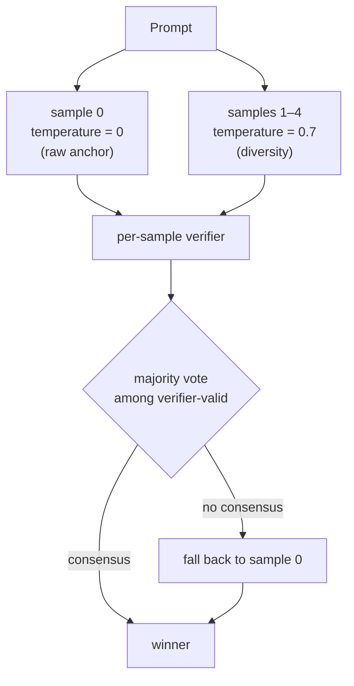

# SMBoost — small-model decoding harness

[](https://github.com/haiyang5535/smboost/actions/workflows/ci.yml)
[](LICENSE)
[](https://www.python.org/downloads/)

A LangGraph harness that wraps a small open-weight model (Qwen 2.5 2B
Q4_K_M) and lifts pass rate on verifier-friendly benchmarks via
parallel self-consistency sampling, per-sample program verifiers, and
raw-anchored majority voting.

Tested on a M-series MacBook with `llama.cpp`. Numbers below are on
that rig; the same code runs anywhere an OpenAI-compatible local
server is available.

## Headline

| Model | Bench | n | Raw | + harness (C5) | Lift |
|---|---|---|---|---|---|
| Qwen 2.5 2B Q4_K_M | GSM8K | 50 | 20.0 % | **68.0 %** | **3.40 ×** (+48 pp) |
| Qwen 2.5 2B Q4_K_M | HumanEval+ | 50 | 44.0 % | **74.0 %** | **1.68 ×** (+30 pp) |
| Qwen 2.5 0.8B Q4_K_M | GSM8K | 50 | 50.0 % | 58.0 % | 1.16 × (+8 pp) |

Per-task CSVs (`benchmarks/results/full_matrix_v2.csv`,
`benchmarks/results/he_n50_2b.csv`) are `.gitignored`; the Quickstart
below regenerates them from a clean clone.

Zero-regression signature on the 2 B runs: every task raw decoding
gets right, C5 also gets right. The lift comes entirely from the
"raw was wrong but a sibling sample was right" tail. On GSM8K that's
25 new recoveries / 0 regressions; on HumanEval+ it's 15 / 0.

## Why I built this

I wanted to test how far decoding-time techniques alone can push a
small open-weight model on tasks that have a cheap verifier (math
with a numeric answer, code with unit tests). The published research
(self-consistency, program verifiers, PROVE) said most of the lift
should be possible without changing weights or adding a frontier
API; I had not seen a from-scratch engineering implementation
applied to a Q4 quantized 2 B model on local hardware. So I built
one and ran the ablation matrix.

## Quickstart

Tested on macOS / Python 3.10+. Full n=50 reproduction takes
~30 min on an M2 Pro.

```bash
# 1. Clone and install
git clone https://github.com/haiyang5535/smboost && cd smboost
pip install -e ".[bench,local]"

# 2. Download Qwen 2.5 2B GGUF and start the llama.cpp server
mkdir -p models
curl -L -o models/Qwen3.5-2B-Q4_K_M.gguf \
  "https://huggingface.co/unsloth/Qwen3.5-2B-GGUF/resolve/main/Qwen3.5-2B-Q4_K_M.gguf"

python3 -m llama_cpp.server \
  --model models/Qwen3.5-2B-Q4_K_M.gguf \
  --host 127.0.0.1 --port 8000 \
  --n_gpu_layers -1 --n_ctx 8192 \
  --chat_format qwen \
  --chat_template_kwargs '{"enable_thinking": false}' &

# 3. Reproduce a 20-task slice of the headline
export SMBOOST_LLM_BACKEND=server
export SMBOOST_OPENAI_BASE_URL=http://127.0.0.1:8000/v1
export SMBOOST_OPENAI_API_KEY=sk-no-key

python3 scripts/run_gates_0_8b.py \
  --stage GSM8K --model qwen3.5:2b \
  --out-csv /tmp/quickstart.csv \
  --n 20 --modes raw,C5
```

Expected: `raw ≈ 20 %`, `C5 ≈ 60–75 %`. (The driver script is named
`run_gates_0_8b.py` for historical reasons; it works for any
`--model` / `--stage` combination.)

## How it works

C5 is the self-consistency condition, wired in
[`src/smboost/harness/self_consistency_graph.py`](src/smboost/harness/self_consistency_graph.py).



Three pieces:

1. **Parallel sampling.** Five completions in parallel. Sample 0 is
   `temperature=0` (deterministic, equivalent to raw decoding).
   Samples 1–4 are `temperature=0.7` for diversity. The deterministic
   anchor is what gives the harness its zero-regression property.
2. **Per-sample verifier.** Per-benchmark dispatch:
   `execute_program_verifier` for math (extracts `#### N` or runs the
   generated Python), `run_tests_verifier` for code (runs `prompt +
   completion + tests + check(entry_point)` in a subprocess).
3. **Majority vote with raw-anchor tie-break.** Group verifier-valid
   samples by their extracted answer; the largest group wins.
   On no-consensus, fall back to sample 0 — this is what stops the
   harness from drifting on tasks raw already gets right.

Other conditions in the same matrix (C1 grounded retry, C2 AST-only
verifier, C4 invariant suite, C6 real tools) are ablations; their
job is to isolate which mechanism contributes the lift. C5 is the
production winner on the 2 B/Q4 setup.

## What I learned

- **Trust the sandbox, not the harness's self-report.** Earlier
  overnight runs counted harness `status="success"` (which only
  meant "AST parse succeeded") as a benchmark pass, which let
  weaker conditions (C2 AST-only, C4 invariants without execution)
  look like they beat C1. Once I rebuilt the LiveCodeBench runner to
  execute the final program through the sandbox and use *that* pass
  bit, the apparent C2/C4 advantage largely disappeared. Lesson:
  end-to-end ground-truth evaluation has to be the gate, not anything
  the harness reports about itself.
- **Why the raw anchor matters.** Without sample 0 pinned at
  `temperature=0`, no-consensus runs (4–5 disagreeing siblings on a
  hard problem) would tie-break to a random index and regress on
  tasks the model already got right at temperature 0. Pinning the
  anchor turns that failure mode into "fall back to deterministic
  output." This is what makes the zero-regression numbers possible.
- **Boundary collapse on already-strong baselines.** A probe on
  Phi-3 mini-4k Q4 (raw GSM8K ≈ 85 % on n = 20) showed C5 *regressed*
  to 75 %. With only ~3 wrong-on-raw tasks out of 20, the four
  temperature-0.7 sibling samples have more chance of out-voting
  sample 0 with a confidently-consistent-but-wrong majority than they
  have of recovering a raw-wrong task. Self-consistency is a
  low-baseline tool, not universal.
- **Infrastructure choices that matter more than expected.**
  Switching from a generic chat template to `--chat_format qwen` plus
  `chat_template_kwargs='{"enable_thinking": false}'` had a larger
  effect on raw 2 B reliability than several rounds of prompt
  engineering. The `langchain-openai` 1.x payload rewrite silently
  dropped `max_tokens` (it renames to `max_completion_tokens`,
  which `llama.cpp` ignores) — small-model raw completions then run
  away to `n_ctx`. Both required a dedicated subclass
  (`_CompatibleChatOpenAI`).

## What this is not

- **Not a fine-tune.** No weights are touched. Same Q4_K_M GGUF in,
  better answers out.
- **Not a generic agent framework.** The lift is concentrated where
  a cheap verifier exists (math with numeric answers, code with
  tests, structured tool-call validation). On open-ended generation
  it does not apply.
- **Not a universal lift on every base model.** See the Phi-3 boundary
  collapse above. The technique is for low-baseline small models
  pushed to their ceiling.
- **Not a production deployment recipe.** This is a benchmarking and
  ablation rig run on a single M-series MacBook. Latency, batching,
  multi-tenant serving, and observability are out of scope.

## Reproducing the full matrix

```bash
python3 scripts/run_full_matrix_v2.py \
  --benches gsm8k --n 50 \
  --modes raw,C5 \
  --models qwen3.5:0.8b,qwen3.5:2b
```

Crash-safe: re-running skips cells already in the output CSV. Gate
report regenerates from the CSV with `--report-only`.

## Tests

```bash
pytest tests/unit -q
```

485 unit tests across the harness, conditions, verifiers, gates,
and matrix runner. CI runs the same suite (minus the LiveCodeBench
slice that needs downloaded data) on every push.

## Reproducibility note

- M2 MacBook Pro (16 GB unified memory), Python 3.10
- `llama.cpp` server, Q4_K_M GGUFs from
  [unsloth on Hugging Face](https://huggingface.co/unsloth)
- All seeds, server flags, and environment variables documented in
  the `scripts/` directory and the Quickstart above
- Per-task CSVs are deterministic for the raw mode at
  `temperature=0`; the C5 sibling samples at `temperature=0.7`
  introduce sampling variance — the n=50 matrix is the smallest run
  size at which the lift signal stabilizes against that variance

## Longer writeup

For the full story — motivation, the C1–C6 ablation table, the
ground-truth evaluation bug that changed every conclusion, the
mechanism behind the zero-regression property, and the Phi-3
boundary collapse — see [`docs/writeup.md`](docs/writeup.md)
(~2 000 words).

## Prior art

This is a from-scratch engineering implementation in the spirit of
PROVE (Toh et al., 2024 — [arXiv:2410.12608](https://arxiv.org/abs/2410.12608)),
with raw-anchored majority voting added as an explicit
regression-prevention mechanism. Numbers and the ablation matrix are
independently produced on the local Q4 setup described above.

Other directly relevant work:

- *Self-Consistency Improves Chain of Thought Reasoning in Language
  Models* — Wang et al., 2022 ([arXiv:2203.11171](https://arxiv.org/abs/2203.11171))
- *Let's Verify Step by Step* — Lightman et al., 2023
  ([arXiv:2305.20050](https://arxiv.org/abs/2305.20050))

## License

Apache 2.0. See [LICENSE](LICENSE).
